前端测试

1注册/登录模块

主要功能：用户可以在注册登录页面注册DDHelper
web应用的账号，通过登录账号来获取用户想要的B站数据。

1.1用户账号注册

测试过程：

（1）打开DDHelper，进入登录界面；

（2）点击登录界面的登录框下方“注册”按钮，进入注册界面；

（3）在注册界面输入账号名称和密码，输入信息和邮箱，点击“发送验证码”按钮；

（4）在邮箱进行验证；

（5）输入邮箱验证码，点击“确认”按钮，完成注册；

（6）按照后面的账号登录测试进行测试注册是否成功。

测试图：

注册页面及填写，点击“注册”后显示“注册成功”

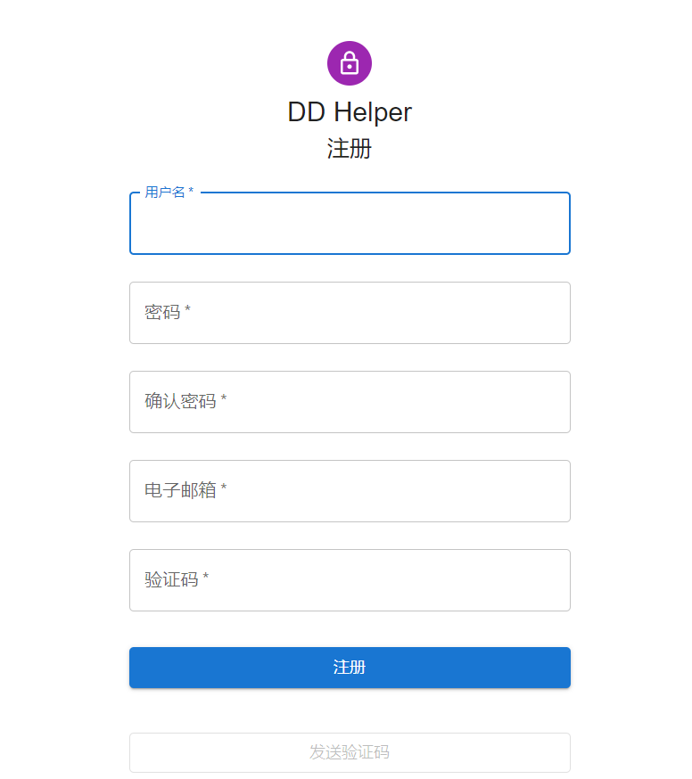
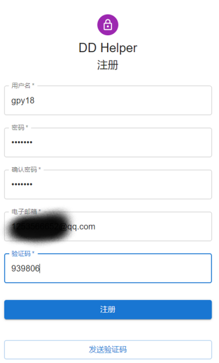

1.2用户账号登录

测试过程：

（1）打开DDHelper，进入登录界面；

（2）在录界面的登录框中输入用户名和密码，点击“登录”按钮；

（3）测试是否登录成功并进入主信息界面。

测试图：

登录成功，进入主信息页面

1.3用户账号登出

测试过程：

（1）打开DDHelper应用，按照登录的测试过程进行账号登录；

（2）点击DDHelper-账号管理下拉框；

（3）打开DDHelper-账号管理下拉框后，点击“登出”按钮；

（4）测试是否成功登出并返回登录界面。

测试图：

用户信息页面

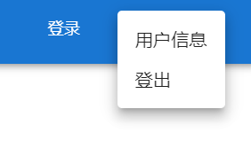

2密码修改

主要功能：用户可以在登录后在DDHelper web应用账号管理界面进行账号密码修改。

2.1修改密码

测试过程：

（1）打开DDHelper应用，按照登录的测试过程进行账号登录；

（2）用户打开DDHelper-账号管理下拉框，点击“用户信息”按钮进入用户信息界面；

（3）在密码修改界面输入旧密码进行验证，并输入新的密码，点击“发送验证码”；

（4）收到验证码后输入验证码，点击“修改密码”

（5）测试密码修改是否成功，按照账号登出测试过程登出后在进行账号登录。

测试图：

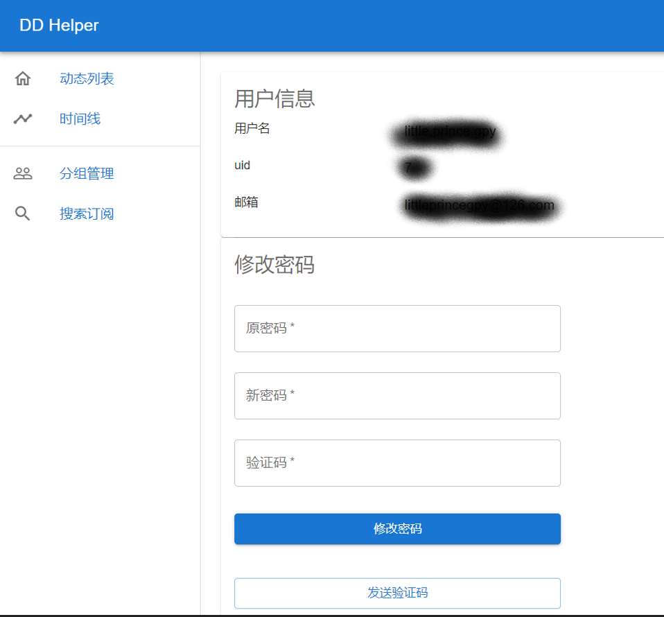

3动态展示系统

主要功能：作为DDHelper web应用的核心功能之一，用户可以在DDHelper
web应用上浏览自己关注的up主的动态，动态可以按照用户对up主的分类进行分组，具体分组操作见分组设置。

3.1浏览动态展示系统

测试过程：

（1）打开DDHelper应用，按照登录的测试过程进行账号登录，进入动态展示界面；

（2）点击动态展示界面中的“动态下拉列表”按钮，显示关注的up主的相关动态；

（3）点击第一个分组的下拉列表，在页面中查看这个分组下的up主的动态；

（4）依照上一条测试步骤测试其他分组的up主动态；

（5）测试“动态下拉列表”中显示不同分组的up主动态的功能是否符合要求；

（6）点击动态展示界面中的“日历时间轴”按钮，显示关注的up主的活动日程；

（7）测试“日历时间轴”中活动时间是否符合功能要求。

测试图：

动态下拉列表

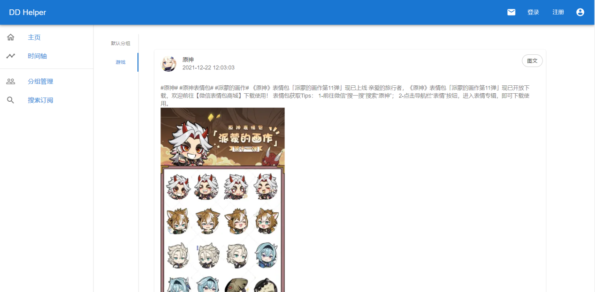

日历时间轴

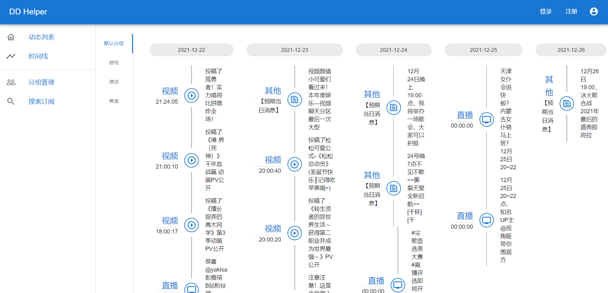

3.2刷新动态展示系统

测试过程：

（1）打开DDHelper应用，按照登录的测试过程进行账号登录，进入动态展示界面；

（2）右键点击 “刷新”按钮，查看新的up主动态；

（3）测试刷新完之后的动态是否及时更新。

测试图：

过一段时间后刷新，可以显示新的动态

刷新前

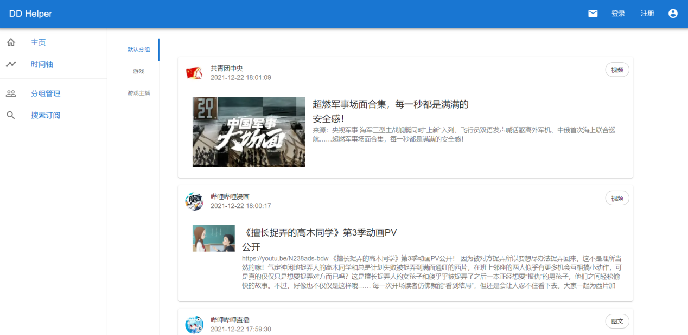

刷新后

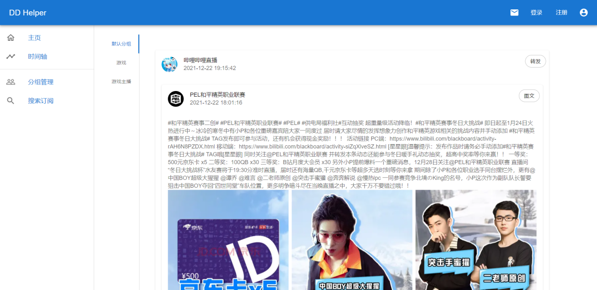

4分组设置查看系统

主要功能：分组设置查看系统主要用于对关注的up主进行分组管理，经过分组后的up主动态可以显示在不同的动态分组中，与动态展示系统相关。分组设置查看系统可以查看up主的分组以及他们的信息，可以创建新的分组，也可以删除分组，并可以把其中的成员移动到其他的不同分组中。

4.1查看分组页面

测试过程：

（1）打开DDHelper应用，按照登录的测试过程进行账号登录；

（2）点击“分组管理”按钮，进入分组管理界面；

（3）点击第一个分组的按钮，显示在第一个分组下的up主，测试能否正常显示；

（4）点击下方的一些分组，测试能否正常显示分组下up主的信息；

测试图：

不同分组的up主信息可以清楚地显示出来

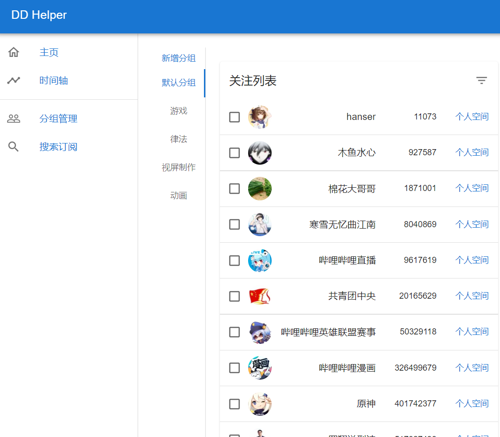

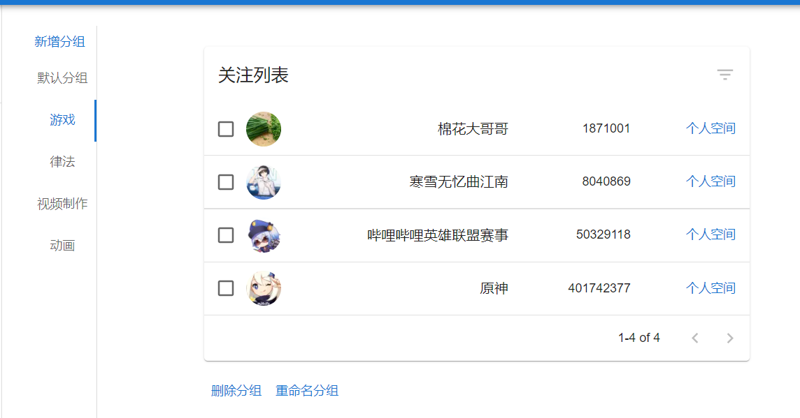

4.2新建分组

测试过程：

（1）打开DDHelper应用，按照登录的测试过程进行账号登录；

（2）点击“分组管理”按钮，进入分组管理界面；

（3）点击“新增分组”按钮，跳出“新分组的名称”的窗口，在窗口中输入新的分组的名称，测试是否产生了新的分组。

测试图：

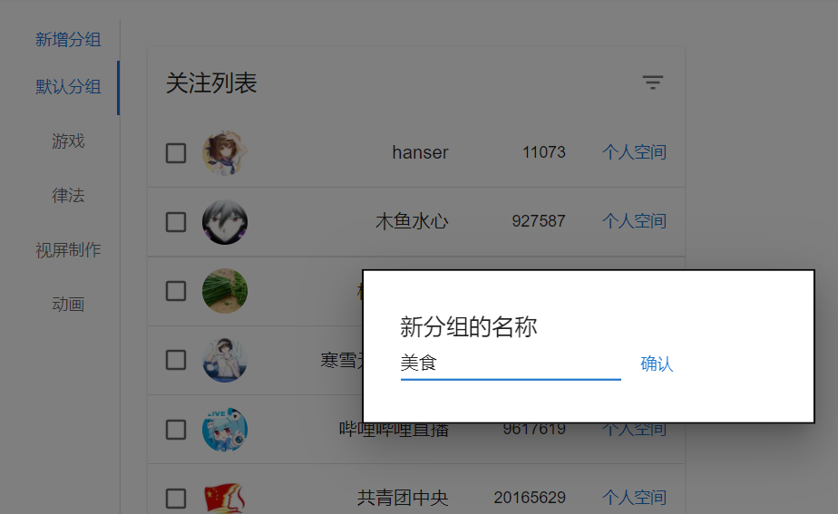

4.3重命名/删除分组

测试过程：

（1）打开DDHelper应用，按照登录的测试过程进行账号登录；

（2）点击“分组管理”按钮，进入分组管理界面；

（3）点击某一个分组，点击下方的按钮，点击“重命名分组”按钮，跳出“重命名”的窗口，在窗口中输入想要命名的分组名称，点击“确定”按钮，测试是否重命名成功；

（4）点击某一个分组，点击下方的按钮，点击“删除分组”按钮，跳出对话框，选择“确定”按钮，测试是否已删除该分组；

测试图：

重命名分组

重命名了“动画”分组

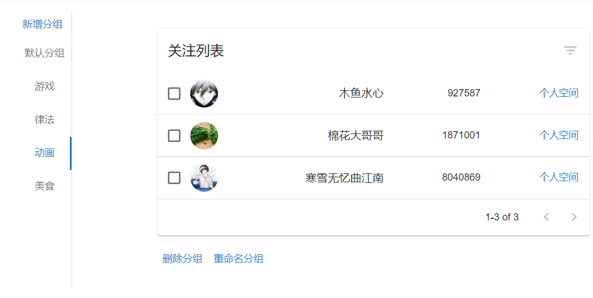

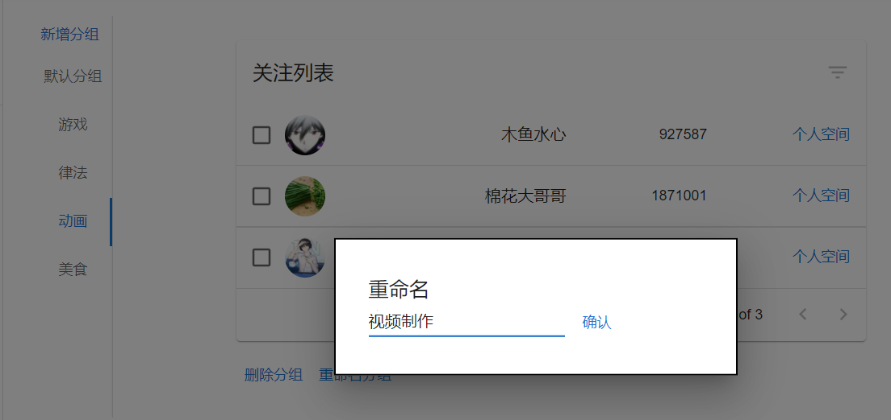

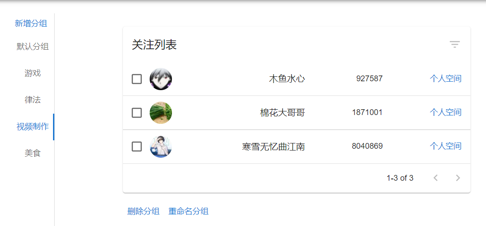

删除分组

删除了“视屏制作”分组

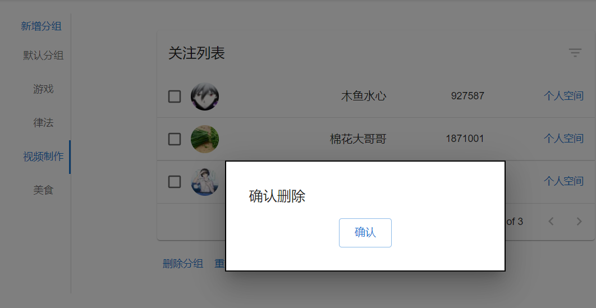

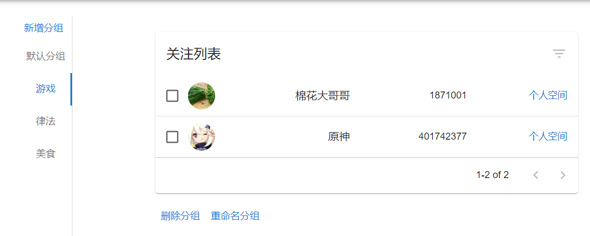

4.4设置up主分组

测试过程：

（1）打开DDHelper应用，按照登录的测试过程进行账号登录；

（2）点击“分组管理”按钮，进入分组管理界面；

（3）勾选分组下的一下账户，点击“移动”按钮，跳出“移动”窗口，点击想要移动到的分组，点击“确认”按钮，测试将分组成员移动到其他分组的功能；

（4）勾选分组下的一下账户，点击“复制”按钮，跳出“复制”窗口，点击想要复制到的分组，点击“确认”按钮，测试将分组成员复制到其他分组的功能；

（5）勾选分组下的一下账户，点击“删除”按钮，跳出对话框，选择“确定”按钮，测试是否已经将成员移出分组。

测试图：

移动后up主被移动到其他分组中

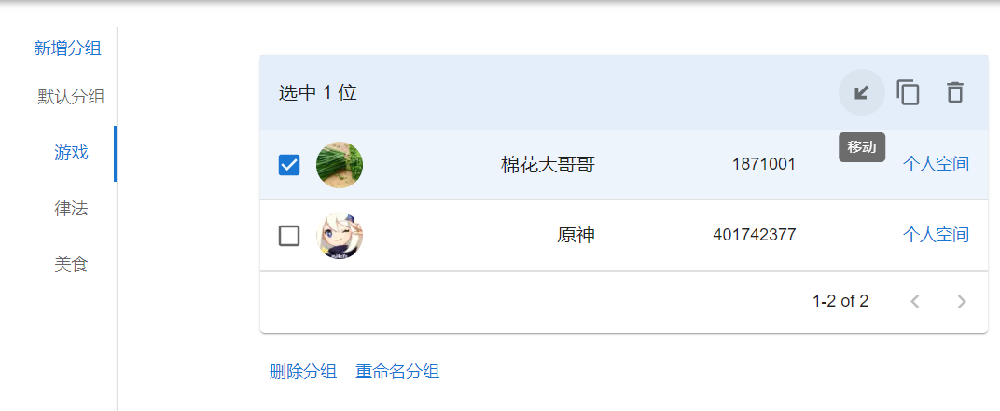

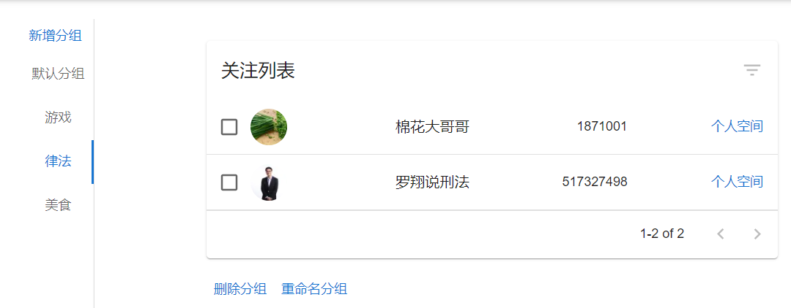

复制功能

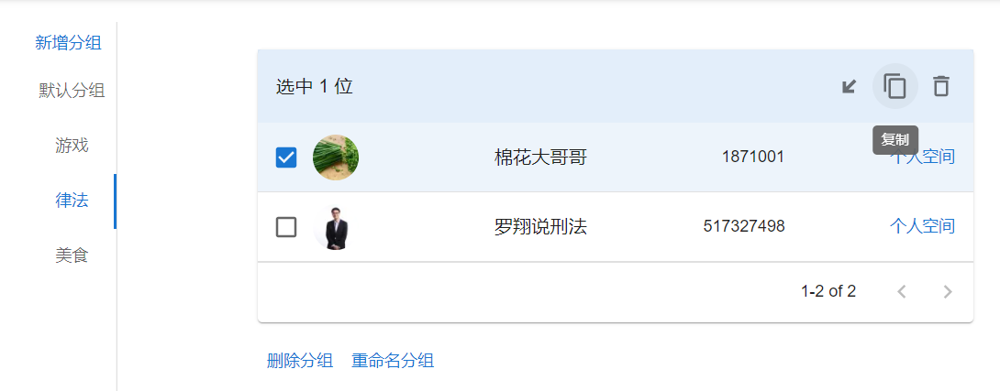

删除功能

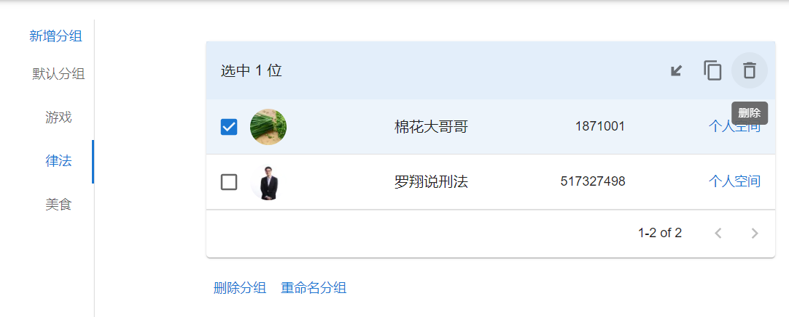

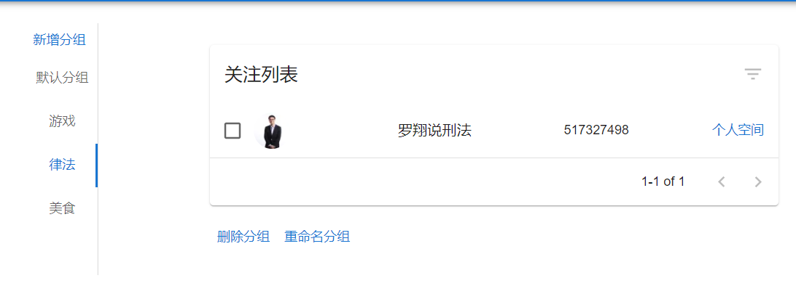

5搜索/关注up主

主要功能：用户可以通过文本框搜索b站up主获得所搜索的up主信息，可以在搜索界面对up主进行关注或者取消关注。

5.1搜索up主

测试过程：

（1）打开DDHelper应用，按照登录的测试过程进行账号登录；

（2）点击“搜索订阅”按钮，进入搜索界面；

（3）在搜索框中输入up主的名字并点击“查找”按钮进行查找；

（4）在下方页面中显示出搜索结果，检测是否和在B站搜索得到的结果相似，是否包含up主的相关信息。

测试图：

可以搜索出想要的结果，且可以支持模糊搜索，会把相关的用户都搜索出来。

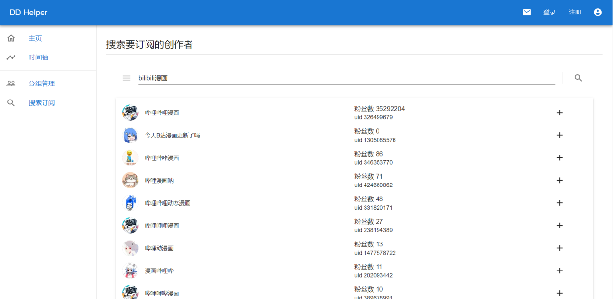

5.2关注up主

测试过程：

（1）打开DDHelper应用，按照登录的测试过程进行账号登录；

（2）点击“搜索”按钮，进入搜索界面；

（3）进行和搜索up主测试主相同的操作搜索得到结果；

（4）在搜索结果页面中点击“关注”按钮关注up主，弹出选择分组的窗口；

（5）在选择分组的窗口勾选想要的分组，并点击“确认”按钮，完成分组设置；

（6）点击分组管理页面，测试是否已经存在新关注的up主。

测试图：

在点击了右侧的“+”之后就可以在关注列表中显示出来

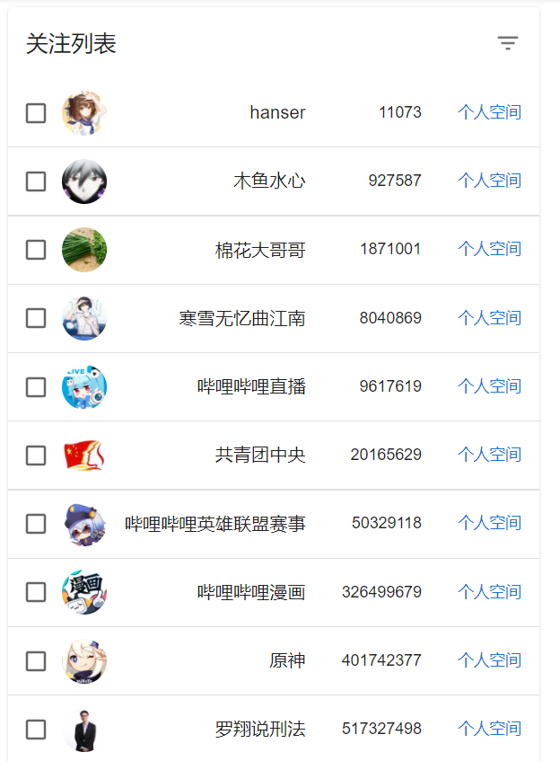
